# Studio Banana

## Live Demo

Frontend: https://your-project.vercel.app

Backend API: https://your-project.onrender.com

**GitHub:** ...


## Overview

Studio Banana is a B2B wholesale clothing platform built for managing
custom-designed clothing products and wholesale orders.

The application provides separate experiences for wholesalers and
administrators. Wholesalers can browse products, manage their cart,
complete checkout, make payments, and track orders. Administrators can
manage products, inventory, wholesalers, and orders through a dedicated
admin dashboard.

The project was built to demonstrate a complete full-stack workflow
using React, Django REST Framework, JWT authentication, PostgreSQL,
and Razorpay.

## Features

### Wholesaler

- Registration and login
- JWT authentication with access-token refresh
- Profile management
- Address management
- Product browsing
- Product search, filtering and ordering
- New-arrival products
- Product details
- Cart management
- Stock validation
- Minimum order quantity validation
- Checkout
- Billing and shipping address management
- Razorpay payment
- Payment retry from order page
- Order history
- Order cancellation
- Order tracking

### Administrator

- Admin authentication
- Dashboard statistics
- Recent orders
- Recent products
- Product management
- Product search, filtering and ordering
- Product activation/deactivation
- New-arrival management
- Wholesaler management
- Wholesaler approval/deactivation
- Order management
- Order search, filtering and ordering
- Order status management
- Estimated delivery management


## User Roles

### Wholesaler

- Register and log in using JWT authentication
- Manage profile and billing info
- Browse , search, filter and sort active products
- Add products to cart
- Manage cart quantities
- Complete checkout
- Make payments
- View orders history and track orders
- Retry payments when required
- Cancel eligible orders

### Administrator

- Access admin dashboard
- View product, order and wholesaler counts
- Manage products and product images
- Add, edit, activate and deactivate products
- Manage product colors, sizes, stock and new arrival
- Approve or deactivate wholesalers
- View and manage orders
- Update order status and estimated delivery
- View payment records


## Tech Stack

### Frontend
- React
- Vite
- React Router
- Axios
- Tailwind CSS
- Framer Motion
- React Icons
- React Hot Toast

### Backend
- Python
- Django
- Django REST Framework
- Simple JWT

### Database
- SQLite (local development)
- PostgreSQL (production)

### Payment
- Razorpay

### Development Tools
- VS Code
- PyCharm
- Postman
- Git / GitHub


## System Architecture

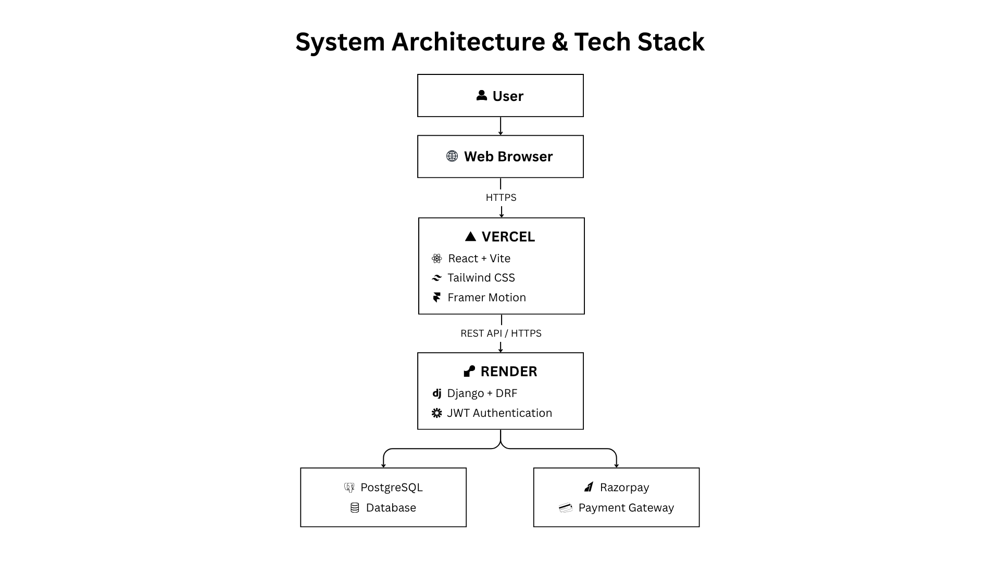


## User Flow

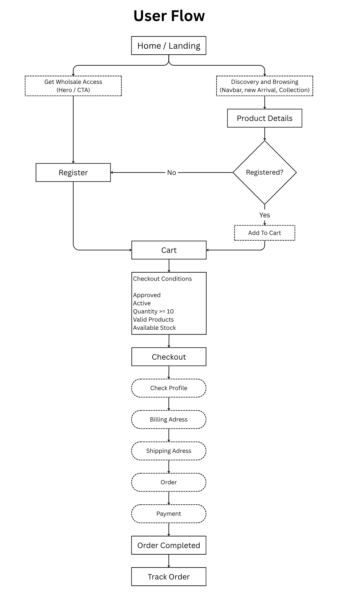


## Admin Flow

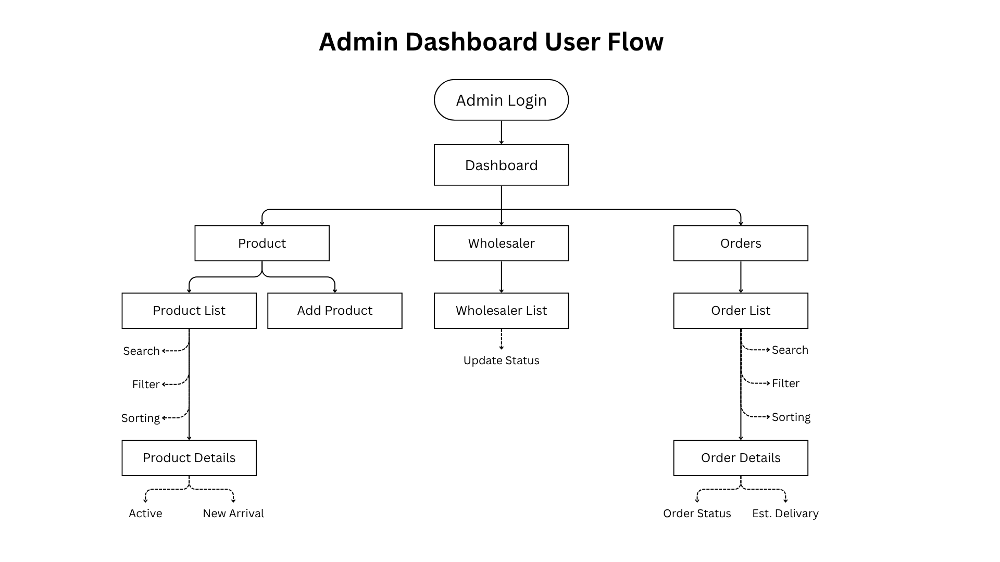


## Database Design

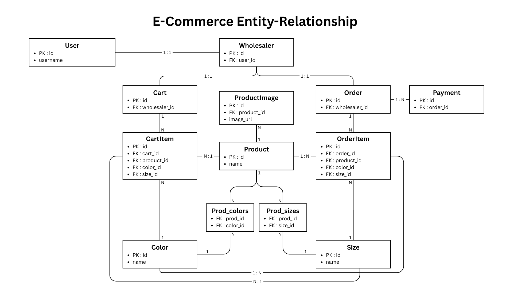


## API Overview

### Authentication

| Method | Endpoint | Access | Description |
|---|---|---|---|
| POST | `/api/login/` | Public | Login |
| POST | `/api/wholesaler/register/` | Public | Register wholesaler |
| POST | `/api/token/refresh/` | Authenticated | Refresh access token |

### Products

| Method | Endpoint | Access | Description |
|---|---|---|---|
| GET | `/api/products/` | Public | View active products |
| GET | `/api/products/{id}/` | Public | View product details |
| GET | `/api/products/` | Admin | View all products including inactive products |
| POST | `/api/products/` | Admin | Add product |
| PATCH | `/api/products/{id}/` | Admin | Edit product |
| DELETE | — | — | Products are deactivated instead of deleted |

### Cart

| Method | Endpoint | Access | Description |
|---|---|---|---|
| GET | `/api/cart/` | Wholesaler | View current cart |
| GET | `/api/cart-items/` | Wholesaler | View cart items |
| POST | `/api/cart-items/` | Wholesaler | Add item |
| PATCH | `/api/cart-items/{id}/` | Wholesaler | Update quantity |
| DELETE | `/api/cart-items/{id}/` | Wholesaler | Remove item |

### Profile

| Method | Endpoint | Access | Description |
|---|---|---|---|
| GET | `/api/wholesaler/profile/` | Wholesaler | View profile |
| PATCH | `/api/wholesaler/profile/` | Wholesaler | Update profile and address |

### Orders

| Method | Endpoint | Access | Description |
|---|---|---|---|
| GET | `/api/orders/` | Wholesaler | View own orders |
| POST | `/api/orders/` | Wholesaler | Create an order |
| PATCH | `/api/orders/{id}/` | Wholesaler | Cancel order where allowed |
| GET | `/api/orders/` | Admin | View all orders |
| PATCH | `/api/orders/{id}/` | Admin | Update order status and delivery information |

### Payments

| Method | Endpoint | Access | Description |
|---|---|---|---|
| POST | `/api/payments/` | Wholesaler | Make or retry payment |
| POST | `/api/payments/verify/` | Backend | Verify Razorpay payment |
| GET | `/api/payments/` | Admin | View payment records |


## Screenshots

### Home




### Products

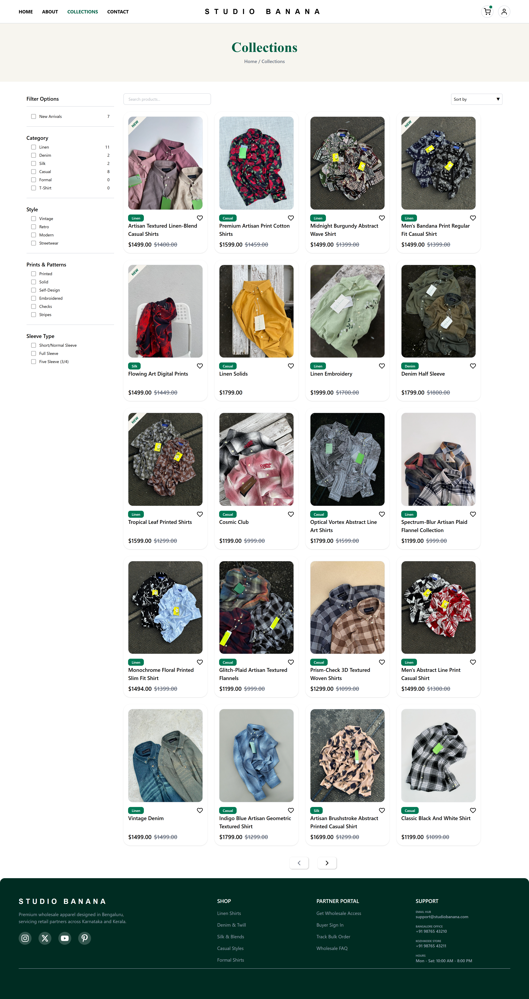

### Product Details

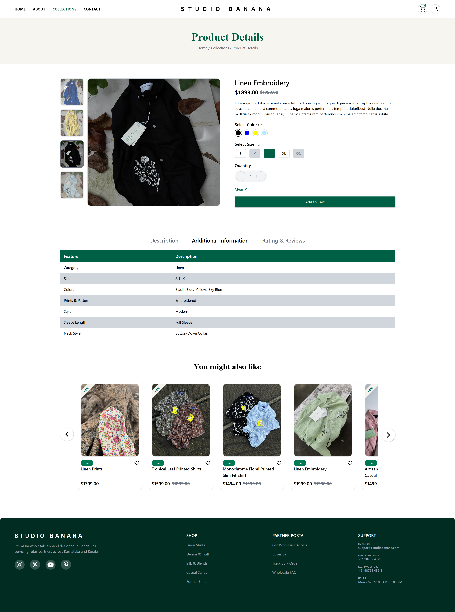

### Cart


### Checkout

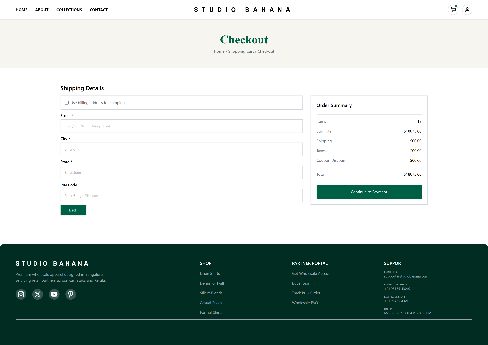

### Order Completed 

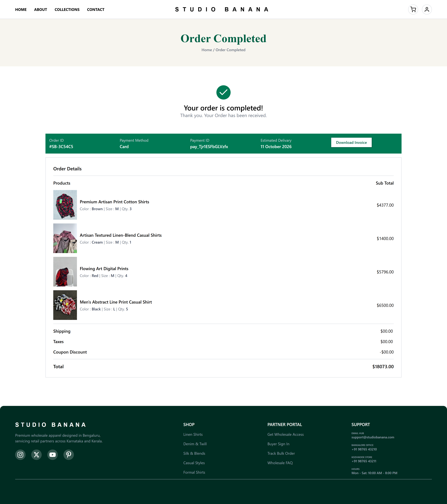

### Track Order


### Profile


### My Orders

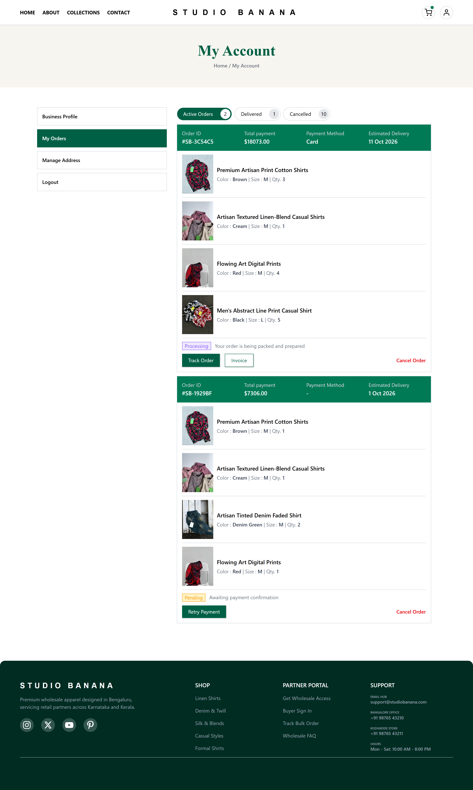

### Admin Dashboard

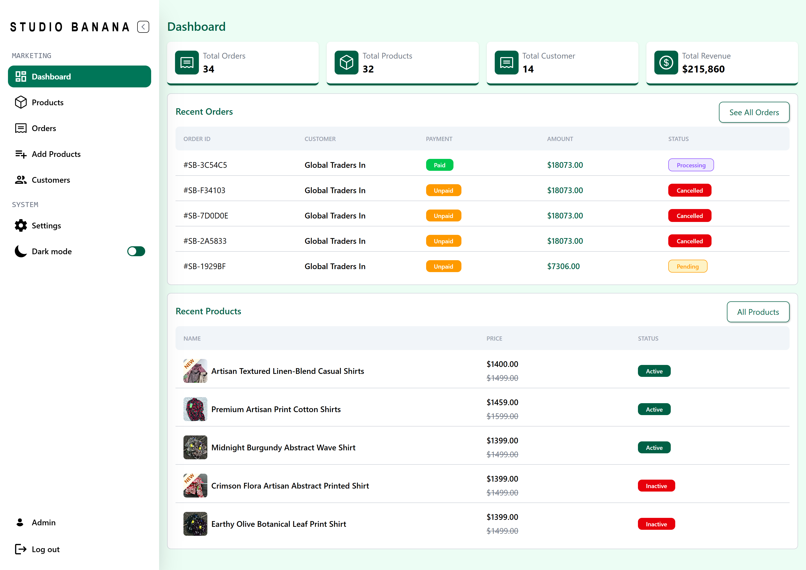

### Admin Products

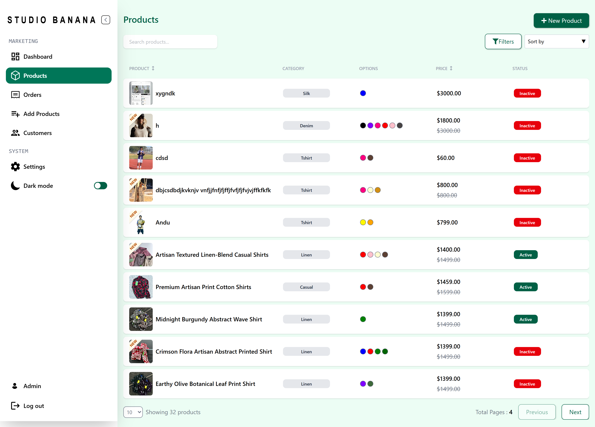

### Admin Wholesalers

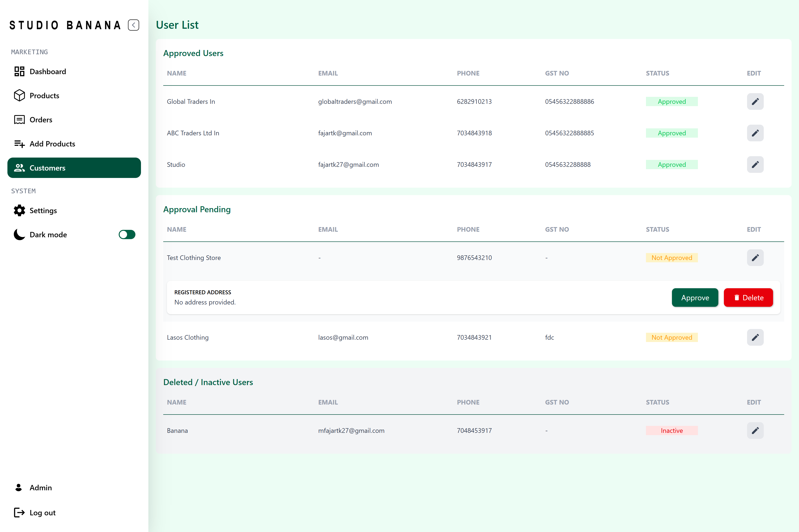

### Admin Orders

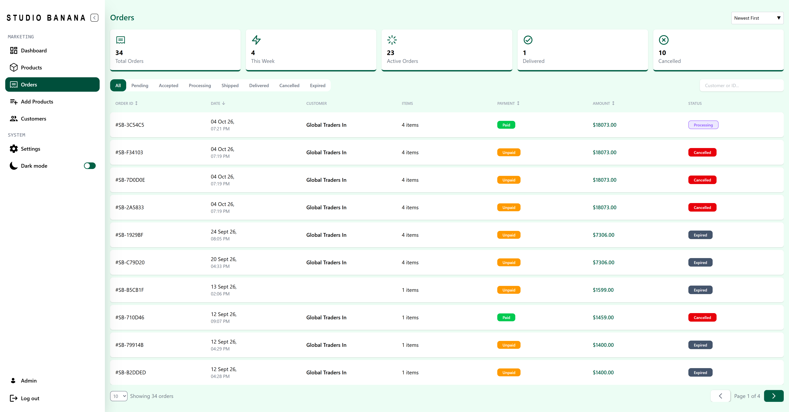


## Landing Page

<!--  -->


## Project Structure

```text
Studio-Banana/
├── Backend/
├── Frontend/
├── docs/
│   ├── architecture.png
│   ├── user-flow.png
│   ├── admin-flow.png
│   ├── er-diagram.png
│   └── screenshots/
└── README.md

```

## Installation


## Environment Variables


## Deployment


## Future Improvements